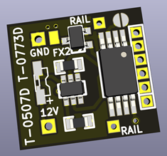

# DCC Function Decoder PCB Data for TOMIX 0507/0773

NMRA規格の信号を受信して動作する、ファンクション専用のDCCデコーダの基板設計データです。

TOMIX製Nゲージ鉄道模型に搭載されている、0507または0773と刻印されている基板と交換してそのまま搭載可能な設計となっております。

回路図、基板設計データ、面付け済みの設計データを含みます。
 面付け済みのデータについては、ガーバーデータも含みます。 (elecrowにて製造できることを確認済み)

### 主要スペック
  * 組み立て後の基板サイズ: 12.5mm x 11.5mm x 2.6mm
  * TOMIX製Nゲージ鉄道模型に搭載されている、0507または0773と刻印されている基板と差し替えて取り付け可能
  * 基板表面にヘッドライト用、裏面にテールライト用のLEDを実装可能 (LEDは面実装タイプ)
  * MOSFETを追加で実装することで、追加のファンクションを1つ配線可能
  * ヘッドライトとテールライトの回路については、定電流回路を搭載し、一定の照度でLEDを点灯可能
  * マイコンプログラム書き込み用端子を装備し、ピンヘッダを使用した簡単な治具でAVRライタと接続し、ファームウェアを変更可能

### 対応するファームウェア
  * [Atmel ATtiny45 DCC Function Decoder Firmware](https://github.com/ytsurui/dcc-funcdecoder-firmware)

### 各種ドキュメント

  * [パーツリスト](docs/partslist.md)